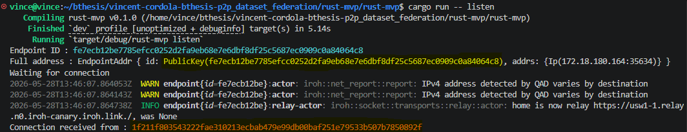
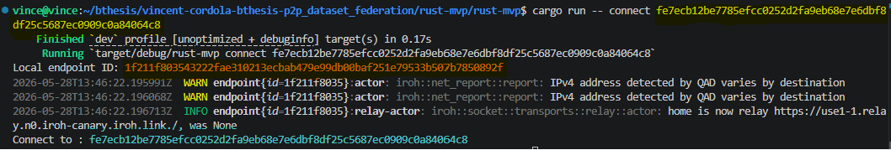
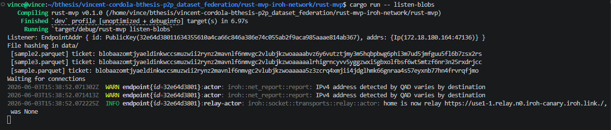
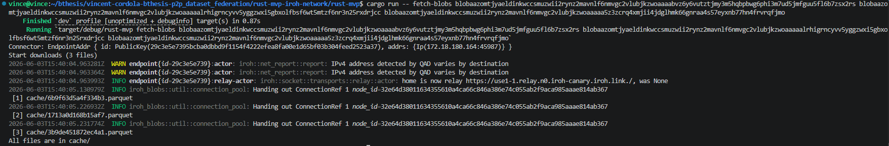
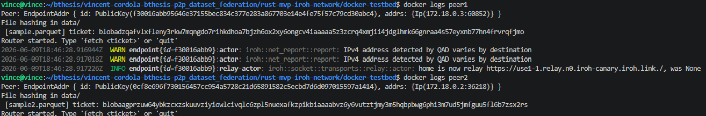
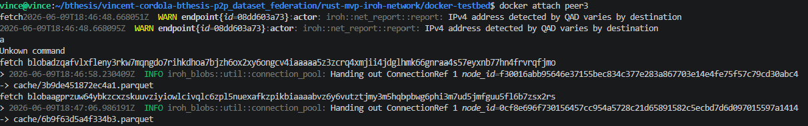
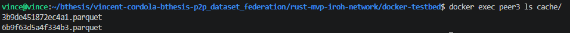

# From Rust MVP to iroh-gossip P2P node
This document retraces, step by step, how the Rust/iroh component of the project evolved during exploration, from the initial prototype to the current gossip-based node. It is a research log rather than a strict specification, the definitive implementation lives in the poject's repository (`peer-dataset-federation`).

## Table of Contents
1. [Setup Rust project](#1-setup-rust-project)
    - [1.1 Install Rust and Cargo](#11-install-rust-and-cargo)
    - [1.2 Project setup](#12-project-setup)
2. [Join an ad hoc iroh network](#2-join-an-ad-hoc-iroh-network)
    - [2.1 Dependencies](#21-dependencies)
    - [2.2 Structure](#22-structure)
    - [2.3 main.rs](#23-mainrs)
    - [2.4 node.rs](#24-noders)
    - [2.5 Result](#25-result)
3. [Advertise and fetch Parquet files](#3-advertise-and-fetch-parquet-files)
    - [3.1 main.rs change](#31-mainrs-change)
    - [3.2 node.rs listen_blobs()](#32-nodesr-listen_blobs)
    - [3.3 node.rs fetch_blobs()](#33-nodesr-fetch_blobs)
    - [3.4 Result](#34-result)
4. [Listen and Connector in parallel](#4-listen-and-connector-in-parallel)
    - [4.1 main.rs peer](#41-mainrs-peer)
    - [4.2 node.rs](#42-nodesr)
5. [Validation on Docker Compose network](#5-validation-on-docker-compose-network)
    - [5.1 Copy cargo files](#51-copy-cargo-files)
    - [5.2 Build and launch](#52-build-and-launch)
    - [5.3 Test](#53-test)
6. [Docker with iroh-gossip](#6-docker-with-iroh-gossip)
    - [6.1 Iroh-gossip](#61-iroh-gossip)
        - [6.1.1 Propagation](#611-propagation)
    - [6.2 Changes made to Cargo.toml](#62-changes-made-to-cargotoml)
    - [6.3 Manifest](#63-manifest)
        - [6.3.1 Data structure](#631-data-structure)
        - [6.3.2 Building the manifest from the existing hash loop](#632-building-the-manifest-from-the-existing-hash-loop)
        - [6.3.3 Saving received manifests](#633-saving-received-manifests)
    - [6.4 Configuration via environment variables](#64-configuration-via-environment-variables)
        - [6.4.1 Bootstrap peers](#641-bootstrap-peers)
    - [6.5 Iroh-gossip in peer()](#65-iroh-gossip-in-peer)
        - [6.5.1 Creating the Gossip protocol and registering it on the router](#651-creating-the-gossip-protocol-and-registering-it-on-the-router)
        - [6.5.2 Derive a stable TopicId](#652-derive-a-stable-topicid)
        - [6.5.3 Subscribe and build the local manifest](#653-subscribe-and-build-the-local-manifest)
        - [6.5.4 The gossip task running in the background](#654-the-gossip-task-running-in-the-background)
        - [6.5.5 Shutdown](#655-shutdown)
    - [6.6 Docker testing procedure](#66-docker-testing-procedure)
        - [6.6.1 Expected directory structure per container](#661-expected-directory-structure-per-container)
        - [6.6.2 docker-compose.yml](#662-docker-composeyml)
        - [6.6.3 Startup procedure](#663-startup-procedure)
7. [Manual manifest refresh (without restarting the node)](#7-manual-manifest-refresh-without-restarting-the-node)
    - [7.1 Problem](#71-problem)
    - [7.2 Sharing the gossip sender](#72-sharing-the-gossip-sender)
    - [7.3 Moving the initial broadcast into gossip_task](#73-moving-the-initial-broadcast-into-gossip_task)
    - [7.4 The refresh command](#74-the-refresh-command)
    - [7.5 Result](#75-result)
    - [7.6 Known limitation](#76-known-limitation)
8. [References](#references)

## 1. Setup Rust project

### 1.1 Install Rust and Cargo
> This comes from [Rust and Cargo installation](https://doc.rust-lang.org/cargo/getting-started/installation.html)

On Linux and macOS systems:
```bash
curl https://sh.rustup.rs -sSf | sh 
```

### 1.2 Project setup
> The following code can be retrieved directly from [What is iroh?](https://docs.iroh.computer/what-is-iroh) and [iroh quickstart](https://docs.iroh.computer/quickstart)   
   

First, initialize a new Rust project:
```bash
cargo init rust-mvp
cd rust-mvp
cargo run
```
This should print `Hello, world!`

## 2. Join an ad hoc iroh network
In this section, I'll show you how to connect two endpoints.

### 2.1 Dependencies
> This version of Cargo allows you to run all the code included in the iroh_setup_guide. For the project itself, please refer directly to the project's Cargo.

Add dependencies (this can be done directly in Cargo.toml).

Cargo.toml:
```toml
[package]
name = "rust-mvp"
version = "0.1.0"
edition = "2024"

[dependencies]
iroh = "0.98.2"
iroh-blobs = "0.100.0"
tokio = { version = "1", features = ["full"] }
anyhow = "1"
n0-error = "0.1"
tracing-subscriber = "0.3"
futures = "0.3"
```
| Dependencies | Role |
|--------------|------|
| iroh | [Modular networking stack for direct p2p connections between devices](https://www.iroh.computer/)| 
| tokio | [Asynchronous Rust runtime](https://tokio.rs/) |
| anyhow | [Simplifies error handling](https://google.github.io/comprehensive-rust/error-handling/anyhow.html) |
| n0-error | [Iroh compatible error handling](https://www.iroh.computer/blog/iroh-0-95-0-new-relay) |
| tracing-subscriber | [Iroh uses this to display internal logs in the terminal](https://docs.rs/tracing-subscriber/latest/tracing_subscriber/) |

### 2.2 Structure

```
src/
    main.rs
    node.rs
```
`main.rs` simply reads what the user wants to do and calls the appropriate function. All the network complexity is encapsulated in `node.rs`.   
These files are separated to make the program easier to read and to modify in the future.


### 2.3 main.rs
> References: [Creating an Endpoint](https://docs.iroh.computer/connecting/creating-endpoint), [iroh example listen.rs](https://github.com/n0-computer/iroh/blob/main/iroh/examples/listen.rs), [iroh example connect.rs](https://github.com/n0-computer/iroh/blob/main/iroh/examples/connect.rs) and [tokio hello tutorial](https://tokio.rs/tokio/tutorial/hello-tokio)

With this code, we'll do three things for now: initialize the logs, read the CLI arguments, and call the appropriate function in `node.rs`.

```Rust
mod node;
use iroh::{EndpointAddr, PublicKey};
use std::{env};

// Create a Tokio runtime and uses it to run `main` as an async function
#[tokio::main]
async fn main() -> anyhow::Result<()> {
    // Initializing log
    tracing_subscriber::fmt::init();

    // Reading the arguments and dispatching
    let args: Vec<String> = env::args().collect();

    match args.get(1).map(String::as_str) {
        Some("listen") => {
            node::listen().await?;
        }
        Some("connect") => {
            // Preparing the address in connect mode
            let id_str = args.get(2).expect("Usage: connect <EndpointId>");
            let public_key: PublicKey = id_str.parse()?;
            let addr = EndpointAddr::new(public_key);
            node::connect(addr).await?;
        }

        _ => {
            eprintln!("Usage:");
            eprintln!("cargo run -- listen");
            eprintln!("cargo run -- connect <EndpointId>")
        }
    }
    Ok(())
}
```
**`#[tokio::main]` and `async fn main`**     
Rust does not natively support async functions as entry points. The `#[tokio::main]` macro solves this: it creates a Tokio runtime and uses it to execute `main` as an async function. All of the project's `async/await` code runs within this runtime.

**Logs initialization**
```Rust
tracing_subscriber::fmt::init();
```
Iroh uses the `tracing` framework for its internal logs. Without this line, no Iroh logs will be visible.

**Read the argument and dispatch**
```Rust
let args: Vec<String> = env::args().collect();
match args.get(1).map(String::as_str) {...}
```
`env::args()` returns the arguments passed after `cargo run --`. The `match` redirects to `listen` or `connect`. The `_` displays instructions on how to use the command if the argument is unknown.

**Address preparation in mode `connect`**
> References: [Struct EndpointAddr](https://docs.rs/iroh/latest/iroh/struct.EndpointAddr.html) and [iroh endpoint](https://docs.iroh.computer/concepts/endpoints)
```Rust
let public_key: PublicKey = id_str.parse()?;
let addr = EndpointAddr::new(public_key);
```
The user provides the listener's `EndpointId` (displayed in their terminal) as a string. These two lines convert it into an `EndpointAddr` that iroh can use to establish the connection.

### 2.4 node.rs
`node.rs` exposes two public functions and a constant. The ALPN constant is shared between the two functions; it is the protocol identifier that allows the two peers to recognize each other.

```Rust
/* 
`node.rs` exposes two public functions and a constant. The ALPN constant
is shared between the two functions, it is the protocol identifier
that allows the two peers to recognize each other.

References: 
    Creating an Endpoint: https://docs.iroh.computer/connecting/creating-endpoint 
    iroh example listen.rs: https://github.com/n0-computer/iroh/blob/main/iroh/examples/listen.rs
    iroh example connect.rs: https://github.com/n0-computer/iroh/blob/main/iroh/examples/connect.rs
    iroh sendme example: https://github.com/n0-computer/sendme
    iroh protocols: https://docs.iroh.computer/concepts/protocols
*/
use iroh::{Endpoint, EndpointAddr, endpoint::presets};
use n0_error::{Result, StdResultExt};

// Example ALPN used to communicate over the `Endpoint`. Taken from https://github.com/n0-computer/iroh/blob/main/iroh/examples/listen.rs
pub const ALPN: &[u8] = b"p2p-parquet/0";

// Listen mode, waiting for connections
pub async fn listen() -> Result<()> {
    // Creating the endpoint
    // Configure with the default settings: relay servers enabled, DNS discovery enabled
    let endpoint = Endpoint::builder(presets::N0)
        // Set the ALPN protocols this endpoint will accept 
        .alpns(vec![ALPN.to_vec()])
        .bind()
        .await?;

    // `endpoint.addr().id` is the local node's public key. This is the value that the user of terminal B will need to copy and paste
    let addr = endpoint.addr();
    println!("Endpoint ID : {}", addr.id);
    println!("Full address : {addr:?}");
    println!("Waiting for connection");

    // Accept loop, `endpoint.accept().await` blocks until an incoming connection arrives
    while let Some(incoming) = endpoint.accept().await {
        let conn = incoming.await.std_context("Incoming connection error")?;
        let remote = conn.remote_id();
        println!("Connection received from : {remote}");
        conn.closed().await;
    }

    Ok(())
}

// Connect mode, connect to a peer
pub async fn connect(addr: EndpointAddr) -> Result<()> {
    // Creating the endpoint
    let endpoint = Endpoint::bind(presets::N0).await?;
    println!("Local endpoint ID: {}", endpoint.addr().id);

    // Establishing the connection
    let conn = endpoint.connect(addr, ALPN).await?;
    println!("Connect to : {}", conn.remote_id());

    // Connection closed
    conn.close(0u32.into(),b"Connection close!");
    endpoint.close().await;

    Ok(())
}
```

**The ALPN constant**
> References: [iroh protocols](https://docs.iroh.computer/concepts/protocols) and [wikipedia ALPN](https://en.wikipedia.org/wiki/Application-Layer_Protocol_Negotiation)
```Rust
pub const ALPN: &[u8] = b"p2p-parquet/0";
```
ALPN (Application-Layer Protocol Negotiation) is an identifier exchanged during the QUIC handshake. If the listener and the connector do not have the same ALPN, the connection is rejected. This is the mechanism by which iroh determines which application protocol will run over the connection.

**`listen` mode, waiting for connections**
```Rust
// Listen mode, waiting for connections
pub async fn listen() -> Result<()> {
    // Creating the endpoint
    // Configure with the default settings: relay servers enabled, DNS discovery enabled
    let endpoint = Endpoint::builder(presets::N0)
        // Set the ALPN protocols this endpoint will accept 
        .alpns(vec![ALPN.to_vec()])
        .bind()
        .await?;

    // `endpoint.addr().id` is the local node's public key. This is the value that the user of terminal B will need to copy and paste
    let addr = endpoint.addr();
    println!("Endpoint ID : {}", addr.id);
    println!("Full address : {addr:?}");
    println!("Waiting for connection");

    // Accept loop, `endpoint.accept().await` blocks until an incoming connection arrives
    while let Some(incoming) = endpoint.accept().await {
        let conn = incoming.await.std_context("Incoming connection error")?;
        let remote = conn.remote_id();
        println!("Connection received from : {remote}");
        conn.closed().await;
    }

    Ok(())
}
```
> References: [iroh docs, endpoint accept](https://docs.rs/iroh/latest/iroh/endpoint/struct.Endpoint.html#method.accept) and [iroh::endpoint Struct Connection](https://docs.rs/iroh/latest/iroh/endpoint/struct.Connection.html)

**Creating the endpoint**   
`Endpoint::builder(presets::N0)` creates an endpoint configured with the default settings: relay servers enabled, DNS discovery enabled. `.alpns(vec![ALPN.to_vec()])` is required on the listener side. Without it, iroh rejects all incoming connections.


**Displaying the address**  
`endpoint.addr().id` is the local node's `PublicKey`. This is the value that the user of terminal B must use. It uniquely and permanently identifies the node on the iroh network.


**Accept loop**     
`endpoint.accept().await` blocks until the next incoming connection. The `while let Some` loop runs indefinitely; the `None` value is only returned if the endpoint is explicitly closed. `incoming.await` completes the TLS/QUIC handshake: at this point, the connection is encrypted and authenticated. `conn.remote_id()` returns the remote peer's `PublicKey`.


**`connect` mode, connect to a peer**
```Rust
pub async fn connect(addr: EndpointAddr) -> Result<()> {
    // Creating the endpoint
    let endpoint = Endpoint::bind(presets::N0).await?;
    println!("Local endpoint ID: {}", endpoint.addr().id);

    // Establishing the connection
    let conn = endpoint.connect(addr, ALPN).await?;
    println!("Connect to : {}", conn.remote_id());

    // Connection closed
    conn.close(0u32.into(),b"Connection close!");
    endpoint.close().await;

    Ok(())
}
```

**Creating the endpoint**   
On the connector side, there's no need to declare ALPN; this is only required to accept incoming connections.

**Establishing the connection**
`endpoint.connect(addr, ALPN).await?` is the central call. Iroh handles all network complexity: it first attempts a direct connection, uses hole punching if necessary, and falls back to the relay server if no direct connection is possible. The `ALPN` passed here must match exactly the one declared by the listener.

**Closing the connection**
> References: [QUIC RFC 9000](https://www.rfc-editor.org/info/rfc9000/#section-10.2)

`conn.close(0u32.into(),b"Connection close!")` sends a QUIC CONNECTION_CLOSE frame. `endpoint.close().await` is asynchronous and waits for all pending messages to be sent before closing the UDP socket. Without this call, the closure might be truncated.


### 2.5 Result
In this section, we will attempt to establish a connection between two endpoints. To do this, we will use two terminals.

First, we launch our `listen` function `cargo run -- listen`. We can see our `EndpointId` and `PublicKey` (highlighted in yellow), and later we'll also be able to see the other peer's `EndpointId`.


Once our `listen` is up and running, we can run our `connect` function in the second terminal. You'll need to specify the `PublicKey` retrieved from our first endpoint: `cargo run -- connect <PublicKey>`. When you run the command, you'll see in the first terminal that the connection has been successfully established.



In both terminals, we can see that each `EndpointId` is present. This confirms that our two endpoints were able to communicate successfully.


## 3. Advertise and fetch Parquet files
> References: [iroh-blobs](https://docs.iroh.computer/protocols/blobs), [transfer.rs](https://github.com/n0-computer/iroh-blobs/blob/main/examples/transfer.rs), [iroh Sendme](https://github.com/n0-computer/sendme)
### 3.1 main.rs change
Two new CLI modes are added to `main.rs`:
```Rust
// file transfer
Some("listen-blobs") => {
    // Process all .parquet files in the data/ directory. Displaying one ticket per file
    // and then waits indefinitely for incoming connections
    node::listen_blobs().await?;
}

Some("fetch-blobs") => {
    let tickets: Vec<String> = args[2..].to_vec();
    if tickets.is_empty() {
        eprintln!("Usage: cargo run -- fetch-blobs <ticket1> ...");
        std::process::exit(1);
    }
    node::fetch_blobs(tickets).await?;
}
```

`listen-blobs`
```Rust
Some("listen-blobs") => {
    node::listen_blobs().await?;
}
```
No arguments are needed. The listener scans `data/` itself and generates one ticket per file.


`fetch-blobs`
```Rust
Some("fetch-blobs") => {
    let tickets: Vec<String> = args[2..].to_vec();
    if tickets.is_empty() {
        eprintln!("Usage: cargo run -- fetch-blobs <ticket1> ...");
        std::process::exit(1);
    }
    node::fetch_blobs(tickets).await?;
}
```
`args[2..]` slices the argument list starting from the third element (index 2), skipping the binary name (index 0) and the `fetch-blobs` command.   


### 3.2 node.rs listen_blobs()
> References: [iroh Tickets](https://docs.iroh.computer/concepts/tickets), [Blob ticket](https://docs.rs/iroh-blobs/latest/iroh_blobs/ticket/struct.BlobTicket.html), [Iroh Router](https://docs.rs/iroh/latest/iroh/protocol/struct.Router.html)
```Rust
// listen_blobs: Process all .parquet files in the data/ directory. Displaying one ticket per file...
pub async fn listen_blobs() -> Result<()> {
    // Create the iroh endpoint
    let endpoint = Endpoint::bind(presets::N0).await?;

    println!("Listener: {:?}", endpoint.addr());

    // Create the in-memory store and the blob protocol
    let store = MemStore::new();
    let blobs = BlobsProtocol::new(&store, None);

    // Hash all .parquet files in data/, for each file, iroh-blobs calculates its BLAKE3 hash
    let data_dir = PathBuf::from("data");
    let mut entries = tokio::fs::read_dir(&data_dir)
        .await
        .std_context("Unable to read data/ folder")?;

    println!("File hashing in data/");
    // The `while let Some` section was created using Claude chatbot
    while let Some(entry) = entries.next_entry().await.std_context("Error reading entry")? {
        let path = entry.path();
        if path.extension().and_then(|e| e.to_str()) == Some("parquet") {
            // `canonicalize` resolves the path to an absolute, canonical form
            let abs_path = path.canonicalize().std_context("Absolute path not found")?;
            let filename = path.file_name().unwrap().to_string_lossy().to_string();

            // add_path hashes the file and returns a tag (hash + format), requires an absolute path
            // The "tag" prevents the store's garbage collector from deleting the blob
            let tag = store.blobs().add_path(abs_path).await
                .std_context("Error during hashing")?;

            // BlobTicket -> Blake3 hash of the file + listener's EndpointId
            // The only information the connector needs to fetch
            let ticket = BlobTicket::new(endpoint.id().into(), tag.hash, tag.format);
            println!(" [{}] ticket: {}", filename,ticket);

        }
    }

    // Start the Router
    // The router replaces the loop `while let Some(incoming)` from fn listen()
    // It accepts incoming connections and routes them to iroh-blobs via ALPN
    let router = Router::builder(endpoint)
        .accept(iroh_blobs::ALPN, blobs)
        .spawn();

    println!("Waiting for connections");

    // Wait for Ctrl+C to exit properly
    tokio::signal::ctrl_c().await.std_context("Signal Ctrl+C")?;
    router.shutdown().await.std_context("Error shutdown")?;

    Ok(())
}
```
**Creating the endpoint**
```Rust
let endpoint = Endpoint::bind(presets::N0).await?;
```
Unlike `listen()` in section 2, there is no `.alpns(vec![...])` call here. This is because the ALPN is now declared at the `Router` level.

**Creating the store and the blobs protocol**
```Rust
let store = MemStore::new();
let blobs = BlobsProtocol::new(&store, None);
```
`MemStore` is an in-memory blob store. It holds the file data and the BLAKE3 metadata. The store lives for the duration of the program.  
`BlobsProtocol::new(&store, None)` wraps the store into a protocol handler. This is the object that will be given to the `Router` to handle incoming blob requests.

**Scanning and hashing the files**
```Rust
let data_dir = PathBuf::from("data");
let mut entries = tokio::fs::read_dir(&data_dir)
    .await
    .std_context("Unable to read data/ folder")?;
```
`PathBuf::from("data")` creates a relative path.    
`tokio::fs::read_dir` opens a directory stream without blocking the Tokio runtime.

```Rust
if path.extension().and_then(|e| e.to_str()) == Some("parquet") 
```
The `if` filter uses `path.extension()`, which returns `Option<&OsStr>`. `and_then(|e| e.to_str())` converts it to `Option<&str>`, and comparing to `Some("parquet")` ensures only `.parquet` files are processed. Any other file in `data/` is skipped.

**Hashing a file and producing its ticket**
```Rust
let tag = store.blobs().add_path(abs_path).await
    .std_context("Error during hashing")?;
```
`add_path` reads the file, computes its BLAKE3 hash, stores the outboard metadata in the `MemStore`, and returns a `Tag`. The `Tag` contains two fields: `tag.hash` (the 32-byte BLAKE3 root hash that uniquely identifies the file's content) and `tag.format` (`raw` for a single blob).   
Keeping the `tag` alive in the store is important: iroh-blobs has a garbage collector, and a blob with no live tag reference is eligible for deletion. 

```Rust
let ticket = BlobTicket::new(endpoint.id().into(), tag.hash, tag.format);
```
`BlobTicket` encodes three things into a single shareable string: the endpoint address (node ID, relay URL, and direct addresses) plus optional application-specific data like a document ID or blob hash. References: [iroh tickets](https://docs.iroh.computer/concepts/tickets)


**Starting the Router**
```Rust
let router = Router::builder(endpoint)
    .accept(iroh_blobs::ALPN, blobs)
    .spawn();
```
The `Router` replaces the manual `while let Some(incoming) = endpoint.accept().await` from section 2's `listen()`. It runs the accept loop in the background and routes each incoming connection to the correct protocol handler based on the ALPN string.  
`.spawn()` launches the router as a background Tokio task.

### 3.3 node.rs fetch_blobs()
```Rust
// fetch_blobs: download the files associated with the tickets to cache/
pub async fn fetch_blobs(raw_tickets: Vec<String>) -> Result <()> {
    // Create the endpoint and store on the connector side
    let endpoint = Endpoint::bind(presets::N0).await?;

    println!("Connector: {:?}", endpoint.addr());

    let store = MemStore::new();

    // Create the cache/ folder if it doesn't exist
    let cache_dir = PathBuf::from("cache");
    tokio::fs::create_dir_all(&cache_dir)
        .await
        .std_context("Unable to create cache/")?;

    // Parse tickets and prepare downloads
    // The downloader coordinates requests to one or more peers.
    // Reusing the same downloader for multiple files is more efficient because iroh can reuse the already-open QUIC connection.
    let downloader = store.downloader(&endpoint);

    let mut ticket_list: Vec<BlobTicket> = Vec::new();

    for raw in &raw_tickets {
        let ticket: BlobTicket = raw.parse().std_context("Invalid ticket")?;
        ticket_list.push(ticket);
    }

    println!("Start downloads ({} files)", ticket_list.len());

    // Downloading and exporting files
    for (i, ticket) in ticket_list.iter().enumerate() {
        downloader
            .download(ticket.hash(), Some(ticket.addr().id))
            .await
            .std_context("Error during download")?;

        // File name: truncated hash + .parquet extension
        let filename = format!("{}.parquet", &ticket.hash().to_string()[..16]);

        // This section (dest) was created using Claude Chatbot
        let dest = cache_dir.canonicalize()
            .std_context("Cannot resolve cache/ to absolute path")?
            .join(&filename);

        // export() copies the blob from MemStore to the file system
        store.blobs().export(ticket.hash(), dest.clone()).await
            .std_context("Error during export")?;

        println!(" [{}] cache/{}", i + 1, filename);
    }

    println!("All files are in cache/");

    endpoint.close().await;


    Ok(())
}
```

**Creating the endpoint and store**
```Rust
let endpoint = Endpoint::bind(presets::N0).await?;
let store = MemStore::new();
```
The connector creates its own independent endpoint and its own `MemStore`. The store here acts as a download buffer: blobs are received and verified into memory first, then exported to disk in a second step.

**Downloader**
```Rust
let downloader = store.downloader(&endpoint);
```
`store.downloader(&endpoint)` creates a `Downloader` bound to both the store and the endpoint. The `Downloader` is the object responsible for opening iroh connections to providers and pulling blobs. Reusing the same `Downloader` instance across multiple downloads allows iroh to reuse the existing QUIC connection for the same peer, avoiding the overhead of a new handshake per file.

### 3.4 Result
For this test, we will also use two terminals, just as in the previous test.

**Files**   
To do this, I first created this file structure:
```
rust-mvp
    cache/
    data/
        sample.parquet
        sample2.parquet
        sample3.parquet
    src/
        main.rs
        node.rs
```

**Listener**    
First, we'll start the listener that will make our Parquet files available as tickets.  
`cargo run -- listen-blobs`


**Connector**   
Now we can launch our connector, which will be able to retrieve our tickets. To do this, we run our `fetch-blobs` command followed by the files we want to retrieve: `cargo run -- fetch-blobs <ticket1> <ticket2> ...`


This is an early version, so we have to enter the tickets manually. We'll be able to improve this in the future using iroh-gossip, which will allow us to automatically discover peers.     
Another addition would be to have a file-naming convention that allows us to see which file corresponds to which hash.

## 4. Listen and Connector in parallel
```Rust
// peer: single process that simultaneously serves local files and accepts interactive fetch commands.
// Commands:
//      - fetch <ticket> | download the file identified by the ticket
//      - quit           | shutdown
pub async fn peer() -> Result<()> {
    // Shared endpoint and store
    let endpoint = Endpoint::bind(presets::N0).await?;
    println!("Peer: {:?}", endpoint.addr());

    let store = MemStore::new();

    // hash local files
    let blobs = BlobsProtocol::new(&store, None);

    let data_dir = PathBuf::from("data");
    let mut entries = tokio::fs::read_dir(&data_dir)
        .await
        .std_context("Unable to read data/ folder")?;

    println!("File hashing in data/");

    // The `while let Some` section was created with the help of Claude chatbot
    while let Some(entry) = entries.next_entry().await.std_context("Error reading entry")? {
        let path = entry.path();
        if path.extension().and_then(|e| e.to_str()) == Some("parquet") {
            let abs_path = path.canonicalize().std_context("Absolute path not found")?;
            let filename = path.file_name().unwrap().to_string_lossy().to_string();

            // add_path hashes the file and returns a tag (hash + format)
            // The "tag" prevents the store's garbage collector from deleting the blob
            let tag = store.blobs().add_path(abs_path).await
                .std_context("Error during hashing")?;

            // BlobTicket -> Blake3 hash of the file + listener's EndpointId
            // The only information the connector needs to fetch
            let ticket = BlobTicket::new(endpoint.id().into(), tag.hash, tag.format);
            println!(" [{}] ticket: {}", filename,ticket);
        }
    }

    // Start the Router
    // .spawn() launches the accept loop as a background Tokio task
    // The Router stays alive as long as this variable is in scope
    let router = Router::builder(endpoint.clone())
        .accept(iroh_blobs::ALPN, blobs)
        .spawn();

    // Prepare cache/ and the downloader once, reused for every fetch command
    let cache_dir = PathBuf::from("cache");
    tokio::fs::create_dir_all(&cache_dir)
        .await
        .std_context("Unable to create cache/")?;

    let downloader = store.downloader(&endpoint);

    // Interactive command loop
    // tokio::io::BufReader wraps stdin so that read_line().await yields control back to the Tokio runtime while waiting for input
    // instead of blocking the thread. This is what allows the Router to keep serving incoming connections
    println!("Router started. Type 'fetch <ticket>' or 'quit'");

    let stdin = tokio::io::BufReader::new(tokio::io::stdin());
    let mut lines = tokio::io::AsyncBufReadExt::lines(stdin);

    // lines.next_line().await blocks asynchronously until the user presses Enter
    // The loop exits when next_line() returns None (stdin closed) or on "quit"
    // This section was created with the help of Claude chatbot
    while let Some(line) = lines.next_line().await.std_context("Error reading stdin")? {
        let line = line.trim().to_string();

        match line.split_once(' ') {
            Some(("fetch", raw_ticket)) => {
                let ticket: BlobTicket = match raw_ticket.trim().parse() {
                    Ok(t) => t,
                    Err(e) => {
                        println!("Invalid ticket: {e}");
                        print!("> ");
                        continue;
                    }
                };

                // Download the blob from the provider identified in the ticket
                match downloader
                    .download(ticket.hash(),Some(ticket.addr().id))
                    .await {
                        Ok(_) => {
                            //
                            let filename = format!("{}.parquet", &ticket.hash().to_string()[..16]);
                            let dest = cache_dir
                                .canonicalize()
                                .std_context("Cannot resolve cache/")?
                                .join(&filename);
                            match store.blobs().export(ticket.hash(), dest).await {
                                Ok(_) => println!("-> cache/{filename}"),
                                Err(e) => println!("Export error: {e}"),
                            }
                        }
                        Err(e) => println!("Download error: {e}"),
                }
            }
            // quit
            _ if line == "quit" => {
                break;
            }

            // unknown command
            _ if line.is_empty() => {}
            _ => println!("Unknown command")
        }

        print!("> ")
    }


    // Shutdown
    router.shutdown().await.std_context("Error shutdown")?;
    endpoint.close().await;

    Ok(())
}
```

### 4.1 main.rs peer
```rust
Some("peer") => {
    node::peer().await?;
}
```
`peer` does not require CLI arguments; tickets are entered interactively.

### 4.2 node.rs
**Problem to be solved**    
When a program waits for keyboard input, it "blocks". In standard Rust, `stdin().read_line()` would block the entire thread, which would kill the Router running in the background.   
Tokio handles this with its asynchronous versions of I/O operations.

```rust
let stdin = tokio::io::BufReader::new(tokio::io::stdin());
```
`tokio::io::stdin()` is the asynchronous version of the standard keyboard input. `BufReader` wraps it so that it can read line by line rather than character by character.

```rust
while let Some(line) = lines.next_line().await... {...}
```
`next_line().await` waits for the next line, but in the meantime it lets the other tasks run. The `.await` allows the Router to send files even when we haven't typed anything.

## 5. Validation on Docker Compose network 
> Objective: Validate peer mode on a network of 3 to 5 isolated Docker containers using manual ticket exchange.

To do this, we're keeping only the peer function. The code is available here: [peer main](docker-testbed/src/main.rs), [peer node](docker-testbed/src/node.rs)

The [Dockerfile](docker-testbed/Dockerfile) and [Docker compose](docker-testbed/docker-compose.yml) have been kept as simple as possible. The goal is simply to demonstrate that our solution works.

### 5.1 Copy cargo files
Copy the Cargo.lock file from the GitHub repository or the mvp-rust repository to avoid any dependency issues.

### 5.2 Build and launch
```
docker compose up --build -d
docker compose ps # check that all 3 peers are "running"
```

### 5.3 Test
First, retrieve the tickets manually. To do this, we'll check the logs in Peers.    
```docker logs <peer>```



Next, we can open the terminal on our peer's machine to fetch the files.    

```docker attach <peer>```



Finally, we can see that the files have been successfully downloaded.



We can see that this is a success: we are currently able to send and receive files between different peers. This confirms that I already have a functional foundation for the project. Adding iroh-gossip and other features may be considered next.

## 6. Docker with iroh-gossip
This section explains how to extend the peer function of the Docker testbed using iroh-gossip.     
Two elements are added:
1. A manifest: a small JSON file listing the name of this node's institution and, for each local Parquet file, its actual name, its BLAKE3 hash, and the BlobTicket required to retrieve it.
2. iroh-gossip: the protocol that automatically distributes this manifest to all other peers, so that each peer ends up with a local copy of every other peer's manifest, without having to exchange tickets manually.

### 6.1 Iroh-gossip
> References: https://docs.iroh.computer/connecting/gossip, https://docs.rs/iroh-gossip/latest/iroh_gossip/

In the previous section, tickets were exchanged manually. Iroh-gossip eliminates this step: once a node knows its own files, it broadcasts them to a shared topic, and every peer connected to that topic receives them automatically.

#### 6.1.1 Propagation
`iroh-gossip` is based on the HyParView and PlumTree algorithms: each node maintains only a handful of neighbors and forwards messages redundantly. As a result, a message eventually reaches all peers even when nodes join, leave, or lose messages.  
No one needs to know everyone in advance. When adding a peer, we only need it to point to a single `EndpointId` at first.


> References: https://serde.rs/ https://docs.rs/serde_json/latest/serde_json/

### 6.2 Changes made to Cargo.toml

Five new dependencies have been added to the existing `Cargo.toml`:
```toml
[package]
name = "rust-mvp"
version = "0.1.0"
edition = "2024"

[dependencies]
iroh = "0.98.2"
iroh-blobs = "0.100.0"
iroh-gossip = "0.98"
tokio = { version = "1", features = ["full"] }
anyhow = "1"
n0-error = "0.1"
n0-future = "0.3"
tracing-subscriber = "0.3"
futures = "0.3"
sha2 = "0.10"
serde = { version = "1", features = ["derive"] }
serde_json = "1"
```

| New dependencies | Role |
|---|---|
| iroh-gossip = "0.98" | Epidemic spread protocol. Fixed at `0.98` to correspond to iroh `0.98.2` |
| n0-future = "0.3" | Provides `StreamExt` needed to read incoming gossip messages using `.next().await` |
| sha2 = "0.10" | Calculates the SHA-256 hash used to derive the gossip `TopicId` |
| `serde` + `serde_json` | Serializes the manifest into JSON for sending to the topic, and deserializes it upon receipt |

### 6.3 Manifest

#### 6.3.1 Data structure
> References: https://serde.rs/ https://docs.rs/serde_json/latest/serde_json/

```Rust
// One entry of the manifest, single Parquet file
#[derive(Debug, Clone, Serialize, Deserialize)]
pub struct ManifestFile {
    pub file_name: String,
    pub hash: String,
    pub ticket: String,
}

// The manifest broadcast by a peer
#[derive(Debug, Clone, Serialize, Deserialize)]
pub struct Manifest {
    pub institution: String,
    pub files: Vec<ManifestFile>,
}
```

`#[derive(Serialize, Deserialize)]` is the `Serde` mechanism that automatically generates the code for converting to and from JSON without having to write it by hand.  
`Manifest` is the JSON representation of this PoC: the institution's name at the top, followed by a list of files. Once serialized, a manifest looks like this:
```JSON
{
  "institution": "peer1",
  "files": [
    {
      "file_name": "sample.parquet",
      "hash": "3b9de451872e...",
      "ticket": "blobad4glngzfp5qabnkqsdkcne3i72u5eq..."
    }
  ]
}
```

#### 6.3.2 Building the manifest from the existing hash loop

The original `peer()` function already scanned the `data/` directory, hashed each `.parquet` file, and displayed a ticket, without ever saving the result. `build_local_manifest_files` performs exactly the same loop, except that it adds a `ManifestFile` to a `Vec` in addition to generating the ticket.

```Rust
async fn build_local_manifest_files(store: &MemStore, endpoint_id: EndpointId) -> Result<Vec<ManifestFile>> {
    let data_dir = PathBuf::from("data");
    let mut entries = tokio::fs::read_dir(&data_dir)
        .await
        .std_context("Unable to read /data folder")?;

    let mut files = Vec::new();

    while let Some(entry) = entries.next_entry().await.std_context("Error reading entry")? {
        let path = entry.path();
        if path.extension().and_then(|e| e.to_str()) == Some("parquet") {
            let abs_path = path.canonicalize().std_context("Absolute path not found")?;
            let filename = path.file_name().unwrap().to_string_lossy().to_string();

            // add_path hashes the file and returns a tag (hash + format)
            // The "tag" prevents the store's garbage collector from deleting the blob
            let tag = store
                .blobs()
                .add_path(abs_path)
                .await
                .std_context("Error during hashing")?;

            // BlobTicket -> Blake3 hash of the file + listener's EndpointId
            let ticket = BlobTicket::new(endpoint_id.into(), tag.hash, tag.format);

            files.push(ManifestFile {
                file_name: filename,
                hash: tag.hash.to_string(),
                ticket: ticket.to_string(),
            });
        }
    }
    Ok(files)
}
```

#### 6.3.3 Saving received manifests
Writes a received manifest to `data/peers_manifest/<institution>.json` so that the cache layer can read it as a plain local file, same as the local manifest.
Overwrites the previous file for that institution, which keeps the folder up to date.
```Rust
async fn save_peer_manifest(manifest: &Manifest) -> Result<()> {
    let peers_dir = PathBuf::from("data/peers_manifest");
    tokio::fs::create_dir_all(&peers_dir)
        .await
        .std_context("Unable to create data/peers_manifest/")?;

    let dest = peers_dir.join(format!("{}.json", manifest.institution));
    let json = serde_json::to_string_pretty(manifest).std_context("Error serializing manifest")?;

    tokio::fs::write(&dest,json)
        .await
        .std_context("Unable to write peer manifest")?;

    Ok(())
}
```

### 6.4 Configuration via environment variables

`env::var("INSTITUTION")` reads the environment variable. If it is missing, `std_context` treats it as an error and the node stops immediately, rather than publishing a manifest without an institution name.

```Rust
let institution = env::var("INSTITUTION").std_context("INSTITUTION environment variable is required")?;
```

#### 6.4.1 Bootstrap peers
> References: https://docs.iroh.computer/connecting/gossip#getting-bootstrap-peers

The Iroh-gossip documentation lists three ways to obtain bootstrap peers: sharing a ticket, using a public rendezvous server, and picking a topic ID. The `TopicId` approach is used here.

```Rust
fn bootstrap_peers_from_env() -> Result<Vec<EndpointId>> {
    let raw = match env::var("BOOTSTRAP_PEERS") {
        Ok(v) if !v.trim().is_empty() => v,
        _ => return Ok(Vec::new()),
    };

    let mut peers = Vec::new();
    for id_str in raw.split(',') {
        let id_str = id_str.trim();
        if id_str.is_empty() {
            continue;
        }
        let id: EndpointId = id_str.parse().std_context("Invalid BOOTSTRAP_PEERS entry")?;
        peers.push(id);
    }
    Ok(peers)
}
```
`BOOTSTRAP_PEERS` is a comma-separated list of `EndpointId`, in the same hexadecimal format already displayed by `endpoint.addr()`.     
An empty or missing variable returns an empty `Vec`, which is the correct value for the first peer: `iroh-gossip` accepts an empty bootstrap and simply waits for someone else to connect.

### 6.5 Iroh-gossip in peer()

#### 6.5.1 Creating the Gossip protocol and registering it on the router

```Rust
    let gossip = Gossip::builder().spawn(endpoint.clone());

    let router = Router::builder(endpoint.clone())
        .accept(iroh_blobs::ALPN, blobs)
        .accept(iroh_gossip::ALPN, gossip.clone())
        .spawn();
```
`Gossip::builder().spawn(endpoint.clone())` creates the gossip manager associated with the same `Endpoint` used for file transfer.  
The `router` in the original version supported only one protocol (`iroh_blobs::ALPN`); a second `.accept(...)` registers `iroh_gossip::ALPN` alongside it. Incoming QUIC connections are routed to one handler or the other based solely on the ALPN negotiated during the handshake.

#### 6.5.2 Derive a stable `TopicId`
> References: https://docs.iroh.computer/connecting/gossip#picking-a-topic-id

```Rust
fn manifest_topic_id() -> TopicId {
    let mut hasher = Sha256::new();
    hasher.update(b"p2p-parquet/manifest/v1");
    let hash = hasher.finalize();
    TopicId::from_bytes(hash.into())
}
```

A gossip topic is identified by a 32-byte `TopicId`. The documentation states that it is recommended to use a cryptographic hash of a meaningful string to avoid collisions with other applications, which is exactly what is done here with SHA-256. All containers hash the same fixed string, so they automatically end up on the same topic without any manual coordination. This topic is used solely for distributing manifests.

#### 6.5.3 Subscribe and build the local manifest

```Rust
let topic_id = manifest_topic_id();

println!("Joining gossip topic with {} bootstrap peer(s)",bootstrap.len());

let (sender, mut receiver) = gossip
    .subscribe(topic_id, bootstrap.clone())
    .await
    .std_context("Error subscribing to gossip topic")?
    .split();

let local_manifest = Manifest {
    institution: institution.clone(),
    files: local_files, 
};

// Also persist our own manifest locally
save_peer_manifest(&local_manifest).await?;
```

`gossip.subscribe(topic_id, bootstrap.clone())` joins the swarm; `bootstrap` is the list read from `BOOTSTRAP_PEERS` and may be empty for the first peer. `split()` divides the subscription into a sender (for sending messages) and a receiver (for reading incoming messages).     
`local_manifest` is built from `local_files`, which were already generated by `build_local_manifest_files`. `save_peer_manifest` immediately writes it to disk: the manifest for this node is therefore visible in `data/peers_manifest/<institution>.json` even before another peer has connected.


#### 6.5.4 The gossip task running in the background
> References: https://docs.iroh.computer/connecting/gossip#waiting-for-peers

```Rust
// Spawn a background task that:
// 1. waits until at least one peer has joined the topic
// 2. broadcasts our manifest once connected
// 3. then listens for manifests broadcast by other peers and saves them to data/peers_manifest
let gossip_task = tokio::spawn(async move {
    if !bootstrap.is_empty() {
        if let Err(e) = receiver.joined().await {
            eprintln!("Gossip: error waiting for peers to join: {e}");
        }
    }

    let payload = match serde_json::to_vec(&local_manifest) {
        Ok(p) => p,
        Err(e) => {
            eprintln!("Gossip: error serializing local manifest: {e}");
            return;
        }
    };

    if let Err(e) = sender.broadcast(payload.into()).await {
        eprintln!("Gossip: error broadcasting manifest: {e}");
    } else {
        println!("Gossip: manifest broadcast for institution '{}'", local_manifest.institution);
    }

    // n0_future::StreamExt is required for '.next()' on the gossip receiver.
    // This `while let Some(event)` section was created with the help of Claude chatbot
    use n0_future::StreamExt;
    while let Some(event) = receiver.next().await {
        match event {
            Ok(Event::Received(message)) => {
                match serde_json::from_slice::<Manifest>(&message.content) {
                    Ok(manifest) => {
                        println!(
                            "Gossip: received manifest from '{}' ({} file(s))",
                            manifest.institution,
                            manifest.files.len()
                        );
                        if let Err(e) = save_peer_manifest(&manifest).await {
                            eprintln!("Gossip: error saving peer manifest: {e}");
                        }
                    }
                    Err(e) => {
                        eprintln!("Gossip: received message is not a valid manifest: {e}");
                    }
                }
            }
            Ok(_) => {
                // Other event kinds (neighbor up/down, etc.) are ignored for this PoC.
            }
            Err(e) => {
                eprintln!("Gossip: stream error: {e}");
                break;
            }
        }
    }
});
```
This task is launched using `tokio::spawn` so that it runs in parallel with the interactive `fetch/quit` loop.

**Wait before broadcasting:** If this node has bootstrap peers (`!bootstrap.is_empty()`), it calls `receiver.joined().await` before sending anything. The first peer (with no bootstrap peers) skips this wait and broadcasts immediately; its manifest will be retrieved by subsequent peers as soon as they connect.

**Broadcast:** `serde_json::to_vec(&local_manifest)` serializes the manifest into JSON bytes. `sender.broadcast(payload.into())` sends it to the topic.

**Receive:** `receiver.next().await` returns one event at a time. `Event::Received(message)` is the only case handled here. `serde_json::from_slice::<Manifest>(&message.content)` decodes it into a `Manifest`, and `save_peer_manifest` writes the JSON file to `data/peers_manifest`. Other event types (neighbor joining, leaving) are captured by `Ok(_) => {}` and ignored, as demonstrated in the official [`chat.rs` example](https://github.com/n0-computer/iroh-gossip/blob/main/examples/chat.rs).

#### 6.5.5 Shutdown
```Rust
gossip_task.abort();
router.shutdown().await.std_context("Error shutdown")?;
endpoint.close().await;
```
Just one line was added: `gossip_task.abort()` right before `router.shutdown()`, so that the gossip task doesn't continue running after `quit`.

### 6.6 Docker testing procedure
This section describes the complete startup workflow for a 3-container testbed.

#### 6.6.1 Expected directory structure per container
```bash
.
├── Cargo.toml
├── Dockerfile
├── data
│   ├── peer1
│   │   ├── peers_manifest
│   │   │   ├── peer1.json # node manifest
│   │   │   ├── # manifests that will be received via Gossip
│   │   └── sample.parquet # File owned by the node
│   ├── peer2
│   │   ├── peers_manifest
│   │   │   ├── peer2.json # node manifest
│   │   │   ├── # manifests that will be received via Gossip
│   │   └── sample2.parquet # File owned by the node
│   └── peer3
│   │   ├── peers_manifest
│   │   │   ├── peer3.json # node manifest
│   │   │   ├── # manifests that will be received via Gossip
│       └── sample3.parquet # File owned by the node
├── docker-compose.yml
├── src
│   ├── main.rs
│   └── node.rs
└── target
    |
    ...
```

#### 6.6.2 docker-compose.yml
Only the `environment` block for each service changes. peer1 starts without `BOOTSTRAP_PEERS`; the other peers point to it. This field should be edited once the first peer is launched.

```yml
services:

  peer1:
    build: .
    container_name: peer1
    stdin_open: true
    tty: true
    environment:
      - INSTITUTION=peer1
    volumes:
      - ./data/peer1:/app/data # peer1 .parquet files
      - peer1_cache:/app/cache # isolated cache
    networks:
      - p2p-net

  peer2:
    build: .
    container_name: peer2
    stdin_open: true
    tty: true
    environment:
        INSTITUTION: peer2
        BOOTSTRAP_PEERS: "" # Enter the nodeID from peer1 here
    volumes:
      - ./data/peer2:/app/data # peer1 .parquet files
      - peer2_cache:/app/cache # isolated cache
    networks:
      - p2p-net

  peer3:
    build: .
    container_name: peer3
    stdin_open: true
    tty: true
    environment:
        INSTITUTION: peer3
        BOOTSTRAP_PEERS: "" # Enter the nodeID from peer1 here
    volumes:
      - ./data/peer3:/app/data # peer1 .parquet files
      - peer3_cache:/app/cache # isolated cache
    networks:
      - p2p-net

volumes:
  peer1_cache:
  peer2_cache:
  peer3_cache:

networks:
  p2p-net:
    driver: bridge
```

#### 6.6.3 Startup procedure
**Build the images**
```bash
docker compose up --build -d
docker compose ps # check that all 3 peers are "running"
```

**Start the first peer**
```bash
docker compose up peer1
```
In the logs `docker logs peer1`, locate the line with `id: PublicKey(acf5d...)`.     
Copy the value of `PublicKey`.

**Edit** `docker-compose.yml` and paste peer1's `PublicKey` into `BOOTSTRAP_PEERS` of the remaining services.

**Start the other peers**
```bash
docker compose up peer2 peer3
```
You should be able to see this in the peer logs:
```bash
Gossip: manifest broadcast for institution 'peer2'
Gossip: received manifest from 'peer3' (1 file(s))
```
And in the `data/peers_manifest/` directory of each container:
```bash
docker exec <peer> ls data/peers_manifest/
# peer1.json peer2.json peer3.json
```

**Test the fetch** operation using a received manifest.  
Once the manifests have been propagated, a ticket contained in a file named `data/peers_manifest/<institution>.json` can be downloaded directly.
```bash
docker attach <peer>
fetch blobaazlu5wae...
> 2026-06-25T15:40:22.872166Z  INFO iroh_blobs::util::connection_pool: Handing out ConnectionRef 1 node_id=32ba76c0...
-> cache/6b9f63d5a4f334b3.parquet
```    

## 7. Manual manifest refresh (without restarting the node)
> References: [tokio mutex](https://docs.rs/tokio/latest/tokio/sync/struct.Mutex.html), [iroh-gossip](https://docs.rs/iroh-gossip/latest/iroh_gossip/)

In section 6, the manifest is broadcast exactly once: right after the node joins the gossip topic, inside `gossip_task`. This has a limitation: if a new `.parquet` file is added to `data/` while the node is already running, the only way to advertise it to the rest of the swarm is to restart the process. This section adds a `refresh` command to the interactive command loop, alongside `fetch` and `quit`, that rescans `data/`, rebuilds the manifest, and rebroadcasts it on demand.

### 7.1 Problem
```bash
fetch <ticket>  | download the file identified by the ticket
quit            | shutdown
```
The interactive loop already supports two commands. Both are handled inside `peer()`, which also owns the `store` and `downloader` used by `fetch`. The gossip `sender`, however, is moved into `gossip_task` and consumed there: it broadcasts once and is then no longer reachable from anywhere else in the program. To rebroadcast from the command loop, the `sender` needs to be reachable from two places at once.

### 7.2 Sharing the gossip sender
> References: [Arc](https://doc.rust-lang.org/std/sync/struct.Arc.html), [tokio mutex](https://docs.rs/tokio/latest/tokio/sync/struct.Mutex.html)

```Rust
let (sender, mut receiver) = gossip
    .subscribe(topic_id, bootstrap.clone())
    .await
    .std_context("Error subscribing to gossip topic")?
    .split();

// Split between gossip_task (initial broadcast) and the stdin loop (manual refresh)
let sender = Arc::new(tokio::sync::Mutex::new(sender));
```
`Arc` allows the same `sender` to be cloned and held by two tasks at once. `Mutex` is required because `GossipSender::broadcast` takes `&self` behind an owned value; only one task may hold the lock at a time, which is exactly what is needed since only one broadcast should happen at any given moment.

### 7.3 Moving the initial broadcast into `gossip_task`
The scan, save, serialize, and broadcast steps that used to happen once before spawning `gossip_task` are moved inside it, so that the exact same sequence can be reused later by the `refresh` command.
```Rust
let gossip_sender = sender.clone();
let gossip_store = store.clone();
let gossip_institution = institution.clone();
let gossip_endpoint_id = endpoint.id();

let gossip_task = tokio::spawn(async move {
    if !bootstrap.is_empty() {
        if let Err(e) = receiver.joined().await {
            eprintln!("Gossip: error waiting for peers to join: {e}");
        }
    }

    match build_local_manifest_files(&gossip_store, gossip_endpoint_id).await {
        Ok(files) => {
            let manifest = Manifest {institution: gossip_institution.clone(), files};
            if let Err(e) = save_peer_manifest(&manifest).await {
                eprintln!("Gossip: error saving local manifest: {e}");
            }
            match serde_json::to_vec(&manifest) {
                Ok(payload) => {
                    let guard = gossip_sender.lock().await;
                    if let Err(e) = guard.broadcast(payload.into()).await {
                        eprintln!("Gossip: error broadcasting manifest: {e}");
                    } else {
                        println! (
                            "Gossip: initial manifest broadcast for institution '{}' ({} file(s))",
                            manifest.institution,
                            manifest.files.len()
                        );
                    }
                }
                Err(e) => eprintln!("Gossip: error serializing manifest: {e}")
            }
        }
        Err(e) => eprintln!("Gossip: error scanning data/: {e}")
    }
```
`sender.clone()`, `store.clone()`, `institution.clone()`, and `endpoint.id()` are taken before the async block, since the block itself takes ownership (`move`) of everything it uses, and both `gossip_task` and the stdin loop need their own copies afterwards.

`gossip_sender.lock().await` waits for the mutex if a `refresh` happens to run at the exact same time. The lock is only held for the duration of the `broadcast` call, and `broadcast` itself operates over an already open gossip stream, so this does not require re-negotiating a connection.

With this change, the local manifest saved in `data/peers_manifest/` and the local files list are no longer prepared before spawning `gossip_task`; they are produced inside it.

### 7.4 The `refresh` command
```Rust
_ if line == "refresh" => {
    match build_local_manifest_files(&store, endpoint.id()).await {
        Ok(files) => {
            let manifest = Manifest { institution: institution.clone(), files };
            match save_peer_manifest(&manifest).await {
                Ok(_) => match serde_json::to_vec(&manifest) {
                    Ok(payload) => {
                        let guard = sender.lock().await;
                        match guard.broadcast(payload.into()).await {
                            Ok(_) => println!("Manifest rebroadcast ({} file(s))", manifest.files.len()),
                            Err(e) => println!("Broadcast error: {e}"),
                        }
                    }
                    Err(e) => println!("Serialize error: {e}"),
                },
                Err(e) => println!("Save error: {e}"),
            }
        }
        Err(e) => println!("Scan error: {e}"),
    }
}
```
`refresh` follows the exact same four steps as the initial broadcast in `gossip_task`: rescan `data/` with `build_local_manifest_files`, save the result locally with `save_peer_manifest`, serialize it to JSON, then broadcast it while holding the shared `sender` lock. Since it runs on the same `Endpoint` and `store` already used by `fetch`, no additional state needs to be created for this command.

Update the startup message accordingly:
```Rust
println!("Router started. Type 'fetch <ticket>', 'refresh' or 'quit'");
```
### 7.5 Result
After adding a new `.parquet` file to `data/` on a running peer, typing `refresh` in its terminal is enough for the other peers to receive it - no restart required.
```bash
> refresh
Manifest rebroadcast (2 file(s))
```
On a peer that was already connected to the topic, the corresponding log line appears without any action on its side:
```bash
Gossip: received manifest from 'peer2' (2 file(s))
```

### 7.6 Known limitation
Each `refresh` rescans and rehashes every file in `data/`, not only the newly added ones. This is acceptable for the file counts expected in this proof of concept, but it means the cost of a refresh grows linearly with the number of local files. Incremental hashing (skipping files whose hash is already known) is a possible improvement for future work.  
A periodic rebroadcast could also be considered.


## References
> Claude chatbot was used at the end to reformat the table of content, annexes and spelling correction

- **R1** | [Rust and Cargo installation](https://doc.rust-lang.org/cargo/getting-started/installation.html)
- **R2** | [What is iroh?](https://docs.iroh.computer/what-is-iroh)
- **R3** | [iroh quickstart](https://docs.iroh.computer/quickstart)
- **R4** | [Creating an Endpoint](https://docs.iroh.computer/connecting/creating-endpoint)
- **R5** | [iroh example listen.rs](https://github.com/n0-computer/iroh/blob/main/iroh/examples/listen.rs)
- **R6** | [iroh example connect.rs](https://github.com/n0-computer/iroh/blob/main/iroh/examples/connect.rs)
- **R7** | [tokio hello tutorial](https://tokio.rs/tokio/tutorial/hello-tokio)
- **R8** | [Struct EndpointAddr](https://docs.rs/iroh/latest/iroh/struct.EndpointAddr.html)
- **R9** | [iroh endpoint](https://docs.iroh.computer/concepts/endpoints)
- **R10** | [iroh protocols](https://docs.iroh.computer/concepts/protocols)
- **R11** | [wikipedia ALPN](https://en.wikipedia.org/wiki/Application-Layer_Protocol_Negotiation)
- **R12** | [iroh docs, endpoint accept](https://docs.rs/iroh/latest/iroh/endpoint/struct.Endpoint.html#method.accept)
- **R13** | [iroh::endpoint Struct Connection](https://docs.rs/iroh/latest/iroh/endpoint/struct.Connection.html)
- **R14** | [QUIC RFC 9000](https://www.rfc-editor.org/info/rfc9000/#section-10.2)
- **R15** | [iroh-blobs](https://docs.iroh.computer/protocols/blobs)
- **R16** | [transfer.rs](https://github.com/n0-computer/iroh-blobs/blob/main/examples/transfer.rs)
- **R17** | [iroh Sendme](https://github.com/n0-computer/sendme)
- **R18** | [iroh Tickets](https://docs.iroh.computer/concepts/tickets)
- **R19** | [Blob ticket](https://docs.rs/iroh-blobs/latest/iroh_blobs/ticket/struct.BlobTicket.html)
- **R20** | [Iroh Router](https://docs.rs/iroh/latest/iroh/protocol/struct.Router.html)
- **R21** | [iroh.computer](https://www.iroh.computer/)
- **R22** | [tokio.rs](https://tokio.rs/)
- **R23** | [anyhow error handling](https://google.github.io/comprehensive-rust/error-handling/anyhow.html)
- **R24** | [Iroh compatible error handling](https://www.iroh.computer/blog/iroh-0-95-0-new-relay)
- **R25** | [tracing-subscriber](https://docs.rs/tracing-subscriber/latest/tracing_subscriber/)