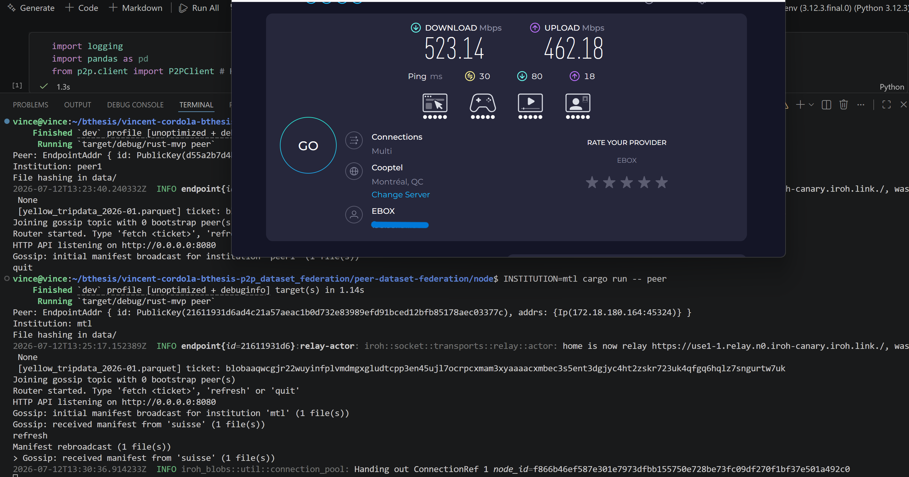
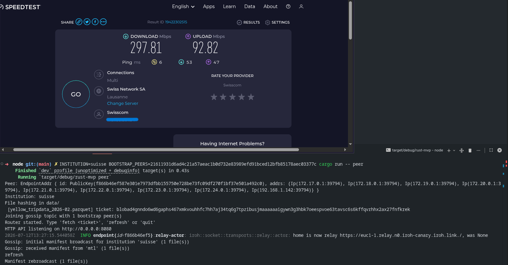
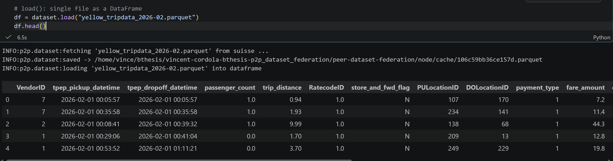

# Evaluation, robustness and real-world conditions
This document outlines the various features and currently known limitations.

## Table of Contents

1. [Real-world test conducted](#1-real-world-test-conducted)
2. [NAT traversal and relay fallback](#2-nat-traversal-and-relay-fallback)
3. [Behavior under realistic conditions](#3-behavior-under-realistic-conditions)
4. [Reliability](#4-reliability)
5. [Error handling](#5-error-handling)
6. [Known limitations](#6-known-limitations)
7. [Future improvement](#7-future-improvement)

## 1. Real-world test conducted
To start with, here is a test conducted between two peers, one in Montréal, Canada and one in Sion, Switzerland (thanks to [Nathan Antonietti](https://github.com/NathanAnto) for his time).

| Parameters | Values |
| --- | --- |
| OS / environment | WSL (Montréal), Arch Linux (Switzerland) |
| Network link | Public internet (no shared LAN / No VPN) |

**Result obtained**
| Measurement | Result |
| --- | --- |
| Project setup (clone -> peer launched) | < 10 minutes |
| Manifest (gossip) propagation between the two peers | < 3 seconds |
| Transferring a 60MB Parquet file (3 million rows, 18 columns) | 6.5 seconds |
> Note that installation is a one-time process; after that, launching the peer takes less than 2 seconds as long as the terminal is open (and it continues to run until the machine is shut down).

The goal of this test was to see if two distant peers could connect and send data to each other.    
In the following screenshots, you can first see the internet connection for the two peers. In the terminal, we also have confirmation that the two peers were able to send and receive manifests.


From the peer in Montréal, I retrieved one of the files that the Switzerland peer had (the name, ticket, etc. were included in the manifest exchanged earlier).    
You can see that retrieving and displaying the file took only 6.5 seconds (60 MB, 3 million lines, and 18 columns).



## 2. NAT traversal and relay fallback
> References: [Gossip broadcast](https://docs.iroh.computer/connecting/gossip), [iroh-gossip crate](https://docs.rs/iroh-gossip/latest/iroh_gossip/), [NeighborUp, NeighborDown](https://docs.rs/iroh-gossip/latest/iroh_gossip/net/type.ProtoEvent.html), [protocole proto hyParView, PlumTree](https://docs.rs/iroh-gossip/latest/iroh_gossip/proto/index.html), [iroh Relays](https://docs.iroh.computer/concepts/relays), [iroh Troubleshooting](https://docs.iroh.computer/troubleshooting)

The behavior is entirely delegated to iroh (`Endpoint::bind(presets::N0)`). No NAT/relay logic is written directly into this project. The procedure is as follows: during setup, each endpoint connects to its nearest relay ([home relay](https://docs.iroh.computer/concepts/relays)) and registers itself as reachable there. It is through this relay that two endpoints establish initial contact, before attempting a direct hole-punch in parallel. If the hole-punch fails (for example, due to overly restrictive NAT on both sides), traffic continues to pass through the relay in a way that is transparent to the application: no error is visible in the code, just higher latency.

To see which route your peers are using, you can use [iroh-doctor](https://github.com/n0-computer/iroh-doctor). `iroh-doctor` is a diagnostic tool: it transfers data between the two machines and reports in real time whether the connection is direct, relayed, or a combination of the two as the transfer progresses.


## 3. Behavior under realistic conditions
> References: [iroh blobs](https://docs.iroh.computer/protocols/blobs), [Blob store design](https://www.iroh.computer/blog/blob-store-design-challenges), [blobs protocol](https://docs.iroh.computer/protocols/blobs)

`iroh-gossip` separates two layers: a membership layer (HyParView) that maintains a partial view of the swarm and detects direct neighbors that appear or disappear, and a broadcast layer (PlumTree) that propagates messages redundantly so that they reach peers even in the event of join, leave, or message loss. This is explicitly documented as the rationale behind the protocol: the broadcast layer accepts that each node has only a partial view of the network and uses probabilistic relaying, since peers can join, leave, change addresses, or lose messages at any time.

**Peers joining / leaving**     
`bootstrap_peers_from_env()` allows a new peer to join via `BOOTSTRAP_PEERS`. A peer that exits (Ctrl+C / quit) simply calls `router.shutdown()`. One addition to this project would be the ability to check whether remote peers are actually online.

**Partial availability**    
Currently, manifest sharing is not automated. The manifest is updated only at startup, or via the manual `refresh` command. If a peer adds or removes a `.parquet` file from its `data/` folder at any point, the other peers won't know about it until that peer performs a `refresh`. An addition to this project would be the automatic detection of these changes so that the user no longer has to do it.

**Variable bandwidth**   
The transfer of a Parquet file uses BLAKE3-verified streaming: the data is divided into chunks, and each chunk is verified on the fly during reception rather than afterward. This means that available bandwidth directly and linearly translates to transfer time (there is no separate verification phase that would be added after the download), but it also means that there is no automatic adaptation (no compression, no quality negotiation): the project simply operates at the available bandwidth and does not adapt to it.

**Warning**

During a local run, the node sometimes logs:


This comes from iroh's internal `net_report` module, which probes the network at startup to characterize the NAT type of the host. It is documented as an internal component of the [iroh repository](https://github.com/n0-computer/iroh).

Iroh determines the endpoint's public address using [QUIC Address Discovery (QAD)](https://www.iroh.computer/blog/qad): when the endpoint reaches out to different relay servers, each one reports back the public IPv4/port it observed via an `OBSERVED_ADDRESS` QUIC frame. For a typical home NAT with a single public IP, this observed address stays the same regardless of which relay answers. This warning means the opposite was observed: the reported public IPv4 address differs depending on which destination server is contacted, which corresponds to the `mapping_varies_by_dest_ip` field surfaced by [iroh-doctor](https://docs.iroh.computer/troubleshooting) reports.

This behavior is characteristic of a destination-dependent NAT, which is harder to hole-punch through, since the external mapping the peer will need to be reached on cannot be predicted in advance from a single probe. It is not an error: the endpoint still works, but a direct connection is less likely to be established for that peer, and traffic is more likely to fall back to the relay (see [2. NAT traversal and relay fallback](#2-nat-traversal-and-relay-fallback)).

## 4. Reliability
> References: [iroh blobs](https://docs.iroh.computer/protocols/blobs), [blob store design](https://www.iroh.computer/blog/blob-store-design-challenges), [BLAKE3](https://www.ietf.org/archive/id/draft-aumasson-blake3-00.html), [iroh tags](https://www.iroh.computer/blog/a-richer-tags-api)

**Partial transfer reinstatement**  
This capability comes entirely from iroh-blobs, not from any logic written in this project. The protocol is explicitly designed to allow transfers to be paused and resumed, using BLAKE3 content-based addressing: each blob is identified by its root hash, and the verified streaming mechanism (based on the BLAKE3 hash tree) allows each received portion to be validated independently. The current code simply calls `downloader.download(hash, peer_id)` once (in `node.rs` and in the `/fetch` handler in `api.rs`). A retry loop would be a possible addition to this project.

**Cache behavior**  
In iroh-blobs, a tag is a name associated with a blob that prevents the garbage collector from deleting it; without a tag, a blob will eventually be deleted. `build_local_manifest_files()` (in `node.rs`) calls `store.blobs().add_path(...)`, which automatically creates a tag for each local file added to the store: it is this tag that ensures that local `.parquet` files are never collected as long as the process is running.

## 5. Error handling
> References: [n0-error](https://github.com/n0-computer/n0-error), [python logging getLogger](https://docs.python.org/3/library/logging.html#logging.getLogger)

### 5.1 Overview
The project has two layers with different error-handling mechanisms, consistent with their respective roles:
| Layer | Mechanism | Role |
|---|---|---|
| Rust (`node.rs`, `api.rs`) | `n0_error::Result` + `.std_context(...)` | Provide a clear context for each error as it is escalated |
| HTTP boundary (`api.rs`, `client.py`) | JSON `{"error": "..."}` + HTTP codes | Convert the Rust error into a simple text message for the client |
| Python (`client.py`, `dataset.py`) | `P2PError` + `logging` | A single type of application exception, logs for operational monitoring |

### 5.2 `n0_error` and the error context
```Rust
use n0_error::{Result, StdResultExt};
```
The project uses `n0_error`, a crate that provides an `anyhow`-style `Result` type (a single "black box" error that can wrap any source), plus the ability to track the exact location in the code where the error occurred. `StdResultExt::std_context(...)` is the method used throughout `node.rs` to attach a human-readable message to an error.
```Rust
let institution = env::var("INSTITUTION").std_context("INSTITUTION environment variable is required")?;
```
Without this `.std_context(...)`, a `std::io::Error` thrown by `?` would simply say "No such file or directory", without specifying which file, or why the program was trying to open it.

### 5.3 Two distinct error types
The code does not handle all errors the same way:

**Fatal errors (before background tasks start)** use `?` and trace back to `main.rs`: if `INSTITUTION` is missing, if `data/` is not readable, or if the endpoint cannot be bound, the entire process stops and a contextualized error message is displayed.

**Recoverable errors (interactive loop, gossip task, fetch task)** are intercepted locally and displayed using `println!`/`eprintln!`, without causing the node to crash.
```Rust
Err(e) => eprintln!("Gossip: error scanning data/: {e}")

Err(e) => println!("Download error: {e}"),
```
Here, the approach is different: a download or broadcast error should not cause a node that is otherwise serving other peers to shut down; only the affected operation fails.

### 5.4 HTTP boundary
The bridge between `node.rs` and `api.rs` returns a `Result<String, String>`, not the original `n0_error`.
```Rust
Ok::<String, String>(filename)

.map_err(|e| format!("Download error: {e}"))
```
Each step of the task converts its error to a String using `.map_err(|e| format!(...))`. This `String` is then returned to the HTTP client in the JSON body `{"error": "..."}`.

### 5.5 Python: client.py and dataset.py
Only one type of application exception
```Python
class P2PError(Exception):
    # Raised when the Rust node returns an error or is unreachable
    pass
```
As documented in [python_client_layer.md](python_client_layer.md), the caller (`P2PDataset`, or the user in a notebook) only needs to know that "the node call failed".

**Two interception layers in `client.py`**  
```Python
try:
    response = requests.get(url, timeout=self.timeout)
except requests.exceptions.ConnectionError as e:
    raise P2PError(f"Cannot reach the Rust node at {self.base_url}") from e
except requests.exceptions.Timeout:
    raise P2PError(f"Request timed out after {self.timeout}s: GET {url}")

self.raise_for_status(response)
```
The `try/except` block catches transport errors (node not started, incorrect port, timeout). `raise_for_status(response)`, which is called afterward, catches application errors.

### 5.6 Logging: `logger.info` / `logger.warning`
```Python
logger = logging.getLogger(__name__)

logger.info("cache hit: %s", file_name)

logger.warning("'%s' not found in any peer manifest", file_name)
```
The convention used here is: `logger.info` for normal events (cache hit, fetch in progress), `logger.warning` for minor issues (file not found, but the caller can continue), and exceptions (`P2PError`) for actual failures that must terminate the call.


## 6. Known limitations
Here is a list of the limitations currently known for this project. Please note that these can all be resolved; they are not permanent limitations. This list may be related to point 7 on future improvements. All of these tasks can be planned and carried out in the future. The goal of this project is to be as flexible as possible, so there are countless possibilities available to you, and each component can be modified or removed as you wish. 
- No automatic deletion of manifests for deleted peers (orphaned JSON files that remain in `data/peers_manifest`).
- `Event::NeighborUp` / `Event::NeighborDown` received by the code but ignored (`Ok(_) => {}`), network join/leave events are neither processed nor logged.
- Manual availability refresh only (`refresh`), no folder watcher or periodic rescan.
- No application-level retry is performed above `downloader.download()` in the event of a failure (only one attempt is made; the error is simply propagated).
- Disk cache (`cache/`) with no size limit, no integrity checks on read (only on download).

## 7. Future improvement
- Partial reads to reduce transfers for larger Parquet artifacts.
- Implement a local database (DuckDB), which is useful if we start needing to work with several thousand Parquet files.
- The node with the API does not need to be directly connected to Python, it would be possible to run the node on a server and allow multiple users to access the file without needing to have that node locally.
- A flag that would need to be anabled on a peer, allowing it to continuously download all files available on the network. This would ensure that certain nodes maintain the availability of the files.

> Claude chatbot was used only to correct spelling errors, when the document had been completed