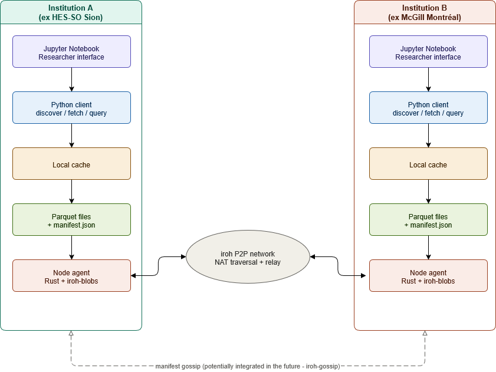

# System Architecture
This document provides an overview of the components used in this project. It describes what each component does and how they communicate with one another. Every institution runs an identical software stack.

This document will be updated throughout the project.

## Table of Contents

## 1. Global Topology
Here is an overview of the project's overall architecture.
  
*system architecture made with draw.io [R1](#r1--drawio)*

### 1.1 Node agent
#### Role       
The Node Agent is the only component that communicates with iroh-blobs protocol. It is responsible for:
- Joining the ad-hoc iroh network and maintaining connectivity to other peers.
- Publish the `manifest.json` file to the network for other nodes
- Send local Parquet files to other peer upon request
- Retrieve Parquet files from other peers
#### Technology

### 1.2 Parquet Files

### 1.3 Local cache

### 1.4 Python client

### 1.5 Jupyter Notebook

## References
##### R1 | [draw.io](https://www.drawio.com/)
##### R2 | [Iroh blobs](https://docs.iroh.computer/protocols/blobs)